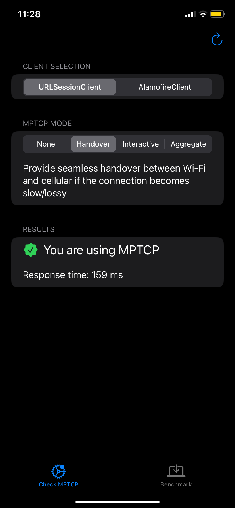
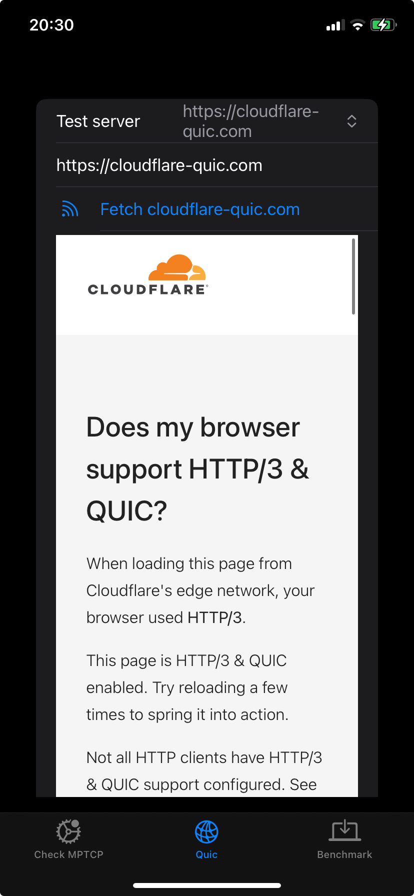
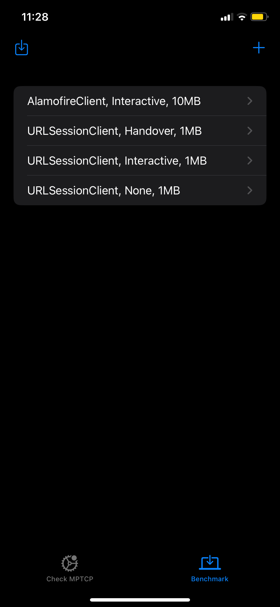
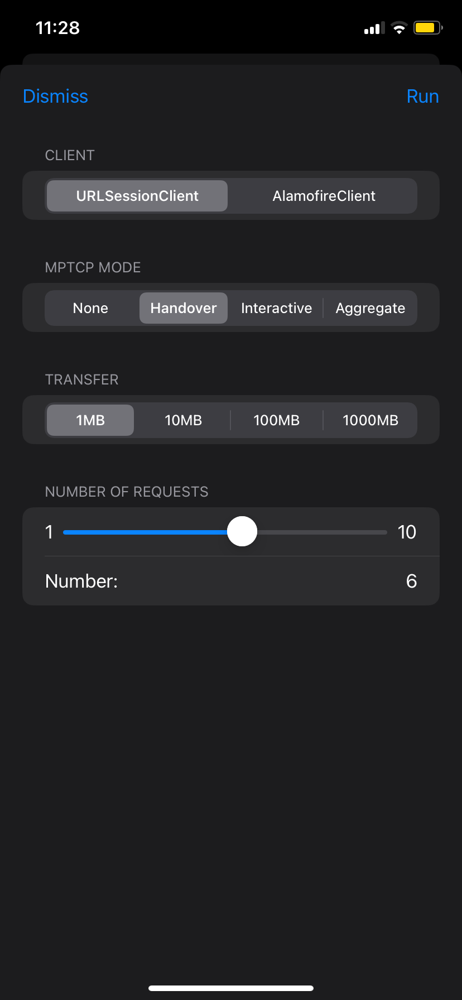
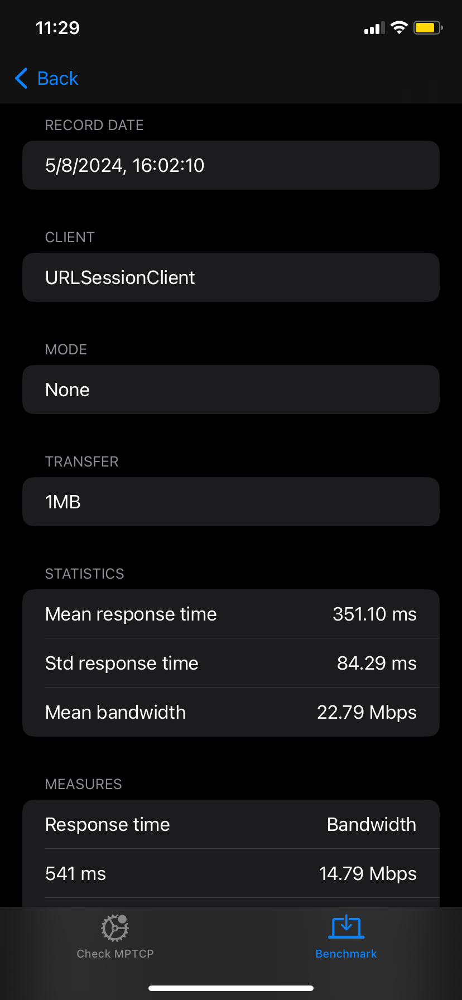
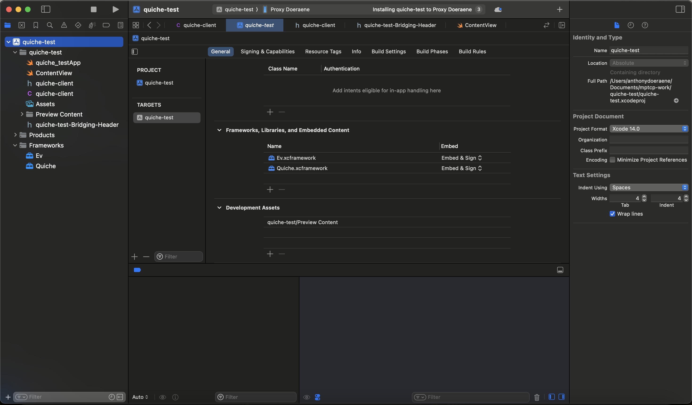

#  MPTCP iOS app example

## Features

### Checking the status of MPTCP

This app allows to check if MPTCP is used on your device or not. To do so, simply go on the tab "Check MPTCP", and you can select different clients/mode of MPTCP to check if they are working. Note that the aggregate mode doesn't seem to be working, as the [MPTCP entitlement may be missing](https://developer.apple.com/documentation/foundation/urlsessionconfiguration/improving_network_reliability_using_multipath_tcp). A demo of this screen is available [here](./demos/mptcp-check.mov). Until now, the following network clients can be used with MPTCP and examples of such MPTCP clients can be found in the [Clients folder](./mptcp-example/Models/Clients):

- [URLSession](https://developer.apple.com/documentation/foundation/urlsession)
- [Alamofire](https://github.com/Alamofire/Alamofire)
- [Network framework](https://developer.apple.com/documentation/network)

Feel free to add other clients to this list in the future!

### Get a website page using Quiche

This app also allows to use Quiche to get html pages and display them. To do so, simply select one of the URLs available, or enter your custom URL, then press the fetch button. After the request has been completed, the HTML received should display below (See [the app preview](#app-preview) for an example).

### Running benchmarks to evaluate MPTCP/QUIC

Another screen of the app is the benchmarking one. On this screen, you can evaluate the performances of using or not MPTCP, by doing some download of various size (1, 10, 100 or 1000 MB). You can also select the number of times this download should be performed, to increase the reliability of results by doing multiple times the measurement. After this, you'll have a report of the results available, showing the response time and estimated bandwidth of the different request, as well as the mean response time and bandwidth once again. You can also delete some measurements that you did. [Here](./demos/mptcp-new-benchmark.mov) is a demo of this feature.

### Exporting results of benchmarks

Having simply the results in the app may be a bit limitating, so you have the possibilty to export the results of experiments in a json file. This allow to use these data to do plots, and further analysis of the results. The demo is available [here](./demos/mptcp-export.mov). Note however that the data is shared between session, so don't worry about losing any data.

### Sending data to a server

You also have the possibility to send the measures done to an external server. An example of such a server is provided
in the [backend](./backend/) folder, which can be run using `python -m flask --host 0.0.0.0 --port 8080`. Once you have a running server, you simply need to change the environment variables in the xcode scheme to set accordingly the
`UPLOAD_HOST` and `UPLOAD_PATH` variables.

## App preview

## Building the app

1) Build the dependencies by running `./build-dependencies.sh`
2) Add the `Quiche` and `Ev` frameworks that were built in [1](#1). to the dependencies
   of your project

3) Select a real device, and click the run button (note that it doesn't work on simulated devices)
